Approximate time: 4 hours

## Learning Objectives:

* Understand the theory for each step in the RNA-Seq workflow
* Become familiar with the terminology and tools used in an RNA-Seq workflow
* Be able to confidently communicate with bioinformaticians and understand RNA-Seq workflows in peer-reviewed literature

[Galaxy](http://usegalaxy.org) is an integrated tool management system with a user-friendly graphical user interface (GUI). It is designed for running multiple bioinformatics tools on genomic data in a single point-and-click environment. In this tutorial we are going to get acquainted with Galaxy. If you are interested in learning more about the system or setting up your own copy we have provided additional links to online courses and public instances on the [resource page](/resources). 

This first session will familiarize you with the system, and we will be using the same principles during the various sequencing modules of the workshops. We’ll see how to access Galaxy from your machine, get oriented and perform some basic tasks. Because genomic data is usually very large and the bioinformatics tools which we use tend to take a very long time to execute, it is a good idea to be running the data analysis on a dedicated computer system as opposed to on your own laptop or machine. This is why in this tutorial series we will be using Galaxy running on a remote machine (“in the Cloud” using [Amazon's EC2 environment](http://aws.amazon.com/ec2/)) which has been set up for you. This environment on the Cloud will be accessible to you for the duration of this course. We will be providing [instructions](../posts/running-your-own-galaxy-instance/) towards the end of the course on how to set up your own system using [CloudMan](http://usecloudman.org/) and get Galaxy running once this course is over.

## Accessing Galaxy

In order for you to be able to access Galaxy on your assigned dedicated machine on the Cloud, you have been given a web or IP address in the form of A.B.C.D where A, B, C and D are numbers separated by dots. 

You will find the current IP address at the top of our [resource page](../resources). You will need it in order to access Galaxy from the web browser on your laptop. 
{: .notice}

> If you want to work through this session outside of this course, take a look at our section on [how to set up your own Galaxy server](../posts/running-your-own-galaxy-instance/) or download the [complete introduction dataset](../data/Galaxy_Introduction_files.tgz) (TGZ archive, 3MB) and use one of the public Galaxy instances.

## The Galaxy interface

Before we get going on an analysis, let's start with exploring what a Galaxy instance actually looks like. Open up a web browser of your choice, and enter the web or IP address given to you during the course into the Address Bar and press ENTER. You should see the main Galaxy screen as shown below. This example was run using the Google Chrome web browser. This is the main `Analyze data` window where data analysis is performed. You should see something similar to the following screenshot. 

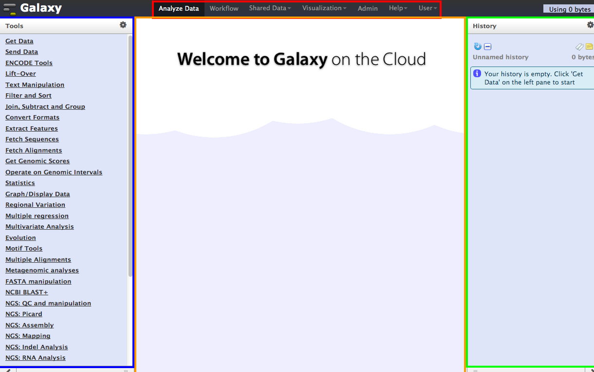

The main page is composed of four primary sections:

1. The center page (orange) is where you will be viewing the data and entering parameter values when running tools. Now you don’t see anything because we haven’t loaded any data and we didn’t run any tools yet. 
2. The left column (blue) is where all of the tools and commands are located, grouped by major headings. You will be selecting tools from here when loading and analyzing data. 
3. The right column (green) is where a history of all the commands that were run are logged. The history is a very powerful feature of Galaxy which allows you to keep track of the steps that were undertaken from the very beginning of loading data, to the very last analysis step. We will see later on how to share your history with your collaborators and how to create workflows from them. Once again, the history is empty because we haven’t run any tools yet.  
4. The very top of the window (red) contains several menus which allow you to move away from this main `Analyze data` page. You can move from one view to another without losing any of your data. We’ll be using some of the other Galaxy functionality offered here in future tutorials. 

You should always remember **to log in to Galaxy** by clicking on the `User` menu item and `Log in` with your email address and password. If you are not already registered, take a moment to do so now. Click on the `User` menu item and `Register`  by filling out your email address, preferred password and a public name (all lowercase) by which you’d like to be identified to other users. Click `Submit` and Galaxy will automatically log you in to your new account. 

Even though it is not required to run analyses, logging in with your account gives you much more power and functionality when it comes to managing histories and workflows. We’ll see this later on. Now that we’ve seen what the various panes do, let’s explore Galaxy with an actual analysis!

## Experimental dataset
The dataset we are using is part of a larger study described in [Kenny PJ et al, Cell Rep 2014](http://www.ncbi.nlm.nih.gov/pubmed/25464849). The authors are investigating interactions between various genes involved in Fragile X syndrome, a disease in which there is aberrant production of the FMRP protein. FMRP has been linked to the microRNA pathway, as it has been shown to be involved in miRNA mediated translational suppression. **The authors sought to show that FMRP associates with the RNA helicase MOV10 for regulation of brain mRNAs.**

From this study we are using the iCLIP data for this introduction to Galaxy, to learn about the Galaxy interface, bringing data into Galaxy, data manipulation, accessing, and for the RNA-Seq tutorial we will be using the RNA-Seq data from the same dataset.
## A workflow example

In our example analysis, our goal will be to generate a list of potential eQTLs by finding SNPs within gene promoters. To keep things manageable, we'll restrict our search to short genes on the X-chromosome. To accomplish our goal we'll need to know a few things:

1. The genes on the X-chromosome and their genomic coordinates.
2. The lengths of these genes; we'll use the number of exons as an approximate measure. 
4. A list of SNPs and their genomic coordinates.
3. The locations of the promoters of our genes; we'll define these as the regions just upstream of the genes' transcriptional start sites.

Some of these we can directly import into Galaxy, others we will calculate from within Galaxy itself. Let's start by importing a list of genes into Galaxy.

### Importing data into Galaxy

You can import data into Galaxy from a large variety of sources: 

* from shared data libraries on Galaxy
* uploaded from a local file on your machine
* from numerous online data repositories 

We will start with first two, simpler, approaches to demonstrate the concepts.

#### Shared Data libraries
{: .no_toc}

You can import data that has been shared with you by the Galaxy site maintainer or from another user. Data libraries[^1] are a convenient framework within Galaxy to store and share data. We will be making use of these today to provide you with sequencing data, intermediate results and other information. Lets start by importing a list of human gene identifiers and their genomic coordinates from the `Shared Data` section:
 
1. Click on `Shared Data` at the top of the page and navigate to `Data Libraries`,  `Galaxy Introduction`.
2. Find and select the `UCSC Gene List hg18` dataset
3. Import them into your current history by selecting `Import to current history` from the `For selected datasets:` menu near the bottom of the page and clicking the `Go`  button located immediately to the right.

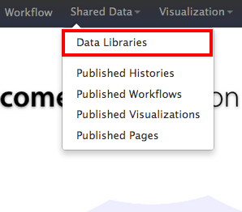

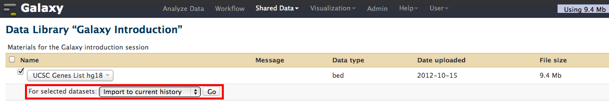

Go back to the main analysis page and you will find the gene list file in your current history, ready to use. Click on the history name "UCSC Genes List hg18" to see a short summary showing that we’ve imported 66,803 regions together with a mini data view underneath. 

#### Data details
{:.no_toc}

Every history entry represents a unified collection of data (or a ‘dataset’), and each will have a number and a name. The numbers will incrementally increase as you perform new operations on your data and the data at each stage will be saved and made available to you in this pane. You can click on the name to expand, or collapse the history entry view. Once expanded, there are several buttons that are available next to the name that allow you to view the data (eye), to edit the parameters or attributes of this data (pencil), or delete it (X)]. 

There are also some additional buttons underneath the title that allow you to download the data (floppy drive), get more information (i), rerun this step (arrow) or several buttons which allow you to visualize this data. In addition, at the very bottom of this entry is a history mini-data view which only shows the first 6 data rows, and it is useful to get a general idea of how the data is structured. The gene information you imported is stored in [BED format](http://genome.ucsc.edu/FAQ/FAQformat.html#format1). Here you can see that the 1st column contains the chromosome name, the 2nd column contains the START and the 3rd column contains the END genomic location coordinates for a particular gene, etc. 

#### Editing data attributes
{:.no_toc}

Let’s take a look at this data in greater detail. If you click on the little “eye” button, you’ll be able to view the entire dataset in the center pane:

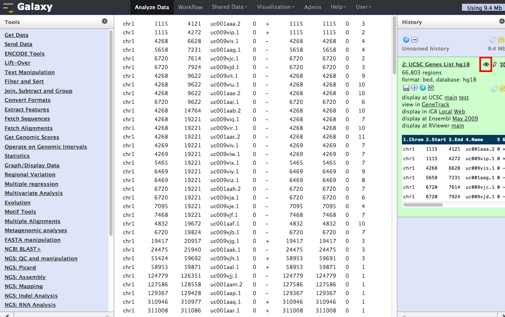

Next to the “eye” button is a little “pencil” button [^2]. If you click on that, you can edit the attributes of this dataset:

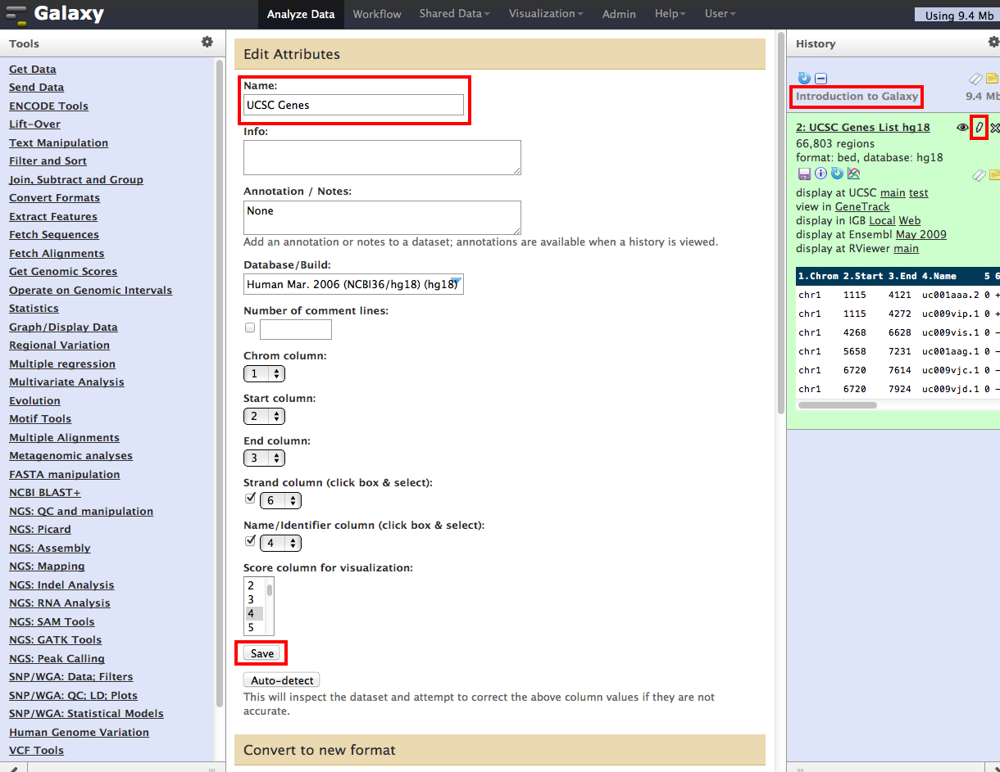

Here let’s change the name of this dataset to “UCSC Genes.” You can also see that it is here where you can specify which columns contain which data, e.g. that column 1 contains chromosome information, etc. We don’t really want to change anything else here, so just click on `Save`. You will then see that the name of this dataset was changed. 

#### Uploading data from your desktop
{: .no_toc}
  
Frequently you will already have generated some data you want to utilize within Galaxy. One simple way to get data into the Galaxy system is by uploading your files to the server, either via FTP or (for smaller data sets) directly through the browser into the current history. To try this you first need to get a file onto your computer:

* **DOWNLOAD** [this file](../data/ucsc_hg18_chrX.bed.txt) from our servers -- it contains the same information as the gene list you retrieved from the data library, but is limited to genes located on the X chromosome. 
* Take note of the download location

After you have the file on your computer, then: 

1. Select the `Get data` tool heading, and select `Upload File` from your Computer. 
2. Under `File`, select `Choose File` and browse to the directory where this file is located. 
3. Under `Genome` type `hg18` in the search bar and select it.
4. Press `Execute`

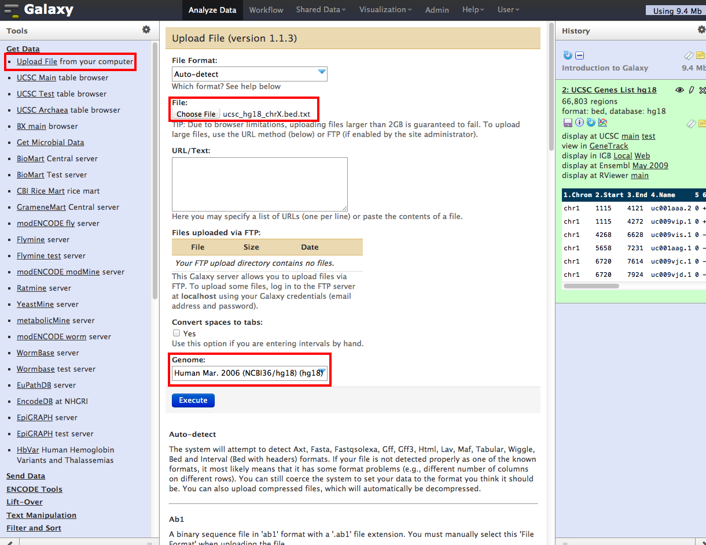

Galaxy will start running, and a new entry will appear in the right history pane. The new entry it will be colored blue in your history as the file is uploaded to the server from your machine, and yellow as it is imported/analysed. Once the import is finished running successfully, it will turn green. You will seee the following screen and the  data will be in your current history, ready to use.

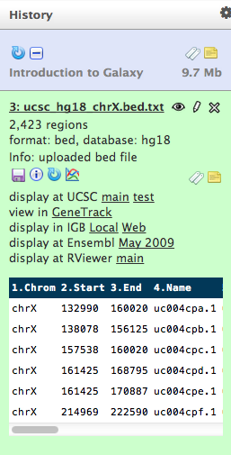

Now we have achieved our first goal, we have a list of genes on the X-chromosome with their genomic coordinates loaded into Galaxy. 

### Data manipulation

Our next step is to subset our list of X chromosome genes to the short genes. To keep things simple, we'll use the number of exons in a gene as a proxy for gene length.

To find these genes, you will need to manipulate the data by sorting, filtering or cutting columns out. Many tasks need these steps because some tools may require that the data be presented in a certain format, but usually we want to organize the data anyway so that it only contains the information we really need, in as a clean format as possible, or to feed the information into a tool requiring a slightly different format. 

#### Subsetting data
{: .no_toc}

You already uploaded a chromosome X gene dataset to Galaxy, representing all genes annotated in the UCSC gene model collection. Let’s simplify the data by only keeping the _UCSC gene names_, their _chromosomal locations_, the _strand_ on which they are located and the **exon counts** on this chromosome. This will require a combination of filtering our BED file followed by data aggregation (summing up the exons). To keep only the data we need, we’ll cut out the columns with this information and discard the rest. 

1. Click on `Text Manipulation` in the tool pane, and then select the `Cut` tool. This tool will extract the columns we want and create a new dataset from them. 
2. In the tool parameters, in `Cut Columns`, type in `c1,c2,c3,c6,c4,c10`. **Notice that the selected  columns are not in order**, we can reorder the columns any way we like. In this case we are placing the strand (column 6) _before_ the gene ID (column 4). 
3. Make sure that`From` contains our uploaded (smaller) dataset. Tools display all valid input files, always make sure the selected data sets are the ones you want to work on.
4. Press `Execute`. You should get a now have a new dataset in your history numbered as `3`. 

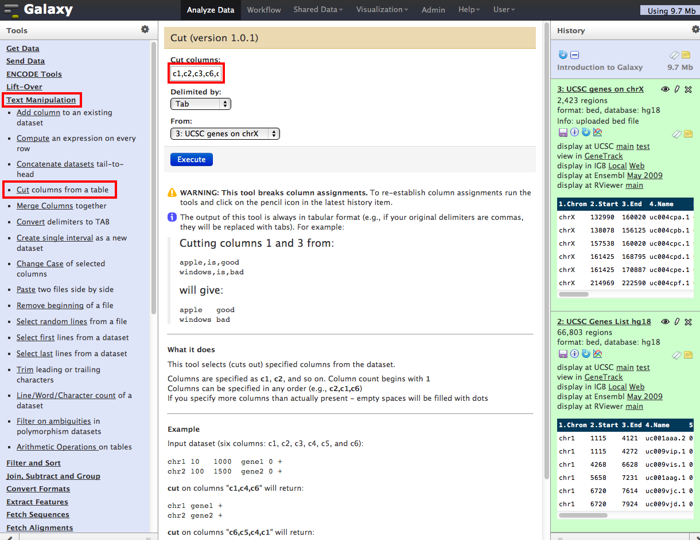

We have now created a new dataset in which we have eliminated unwanted information and kept only those pieces of information that we’ll be using in subsequent steps. Rename this dataset to something you like, and then click `Save`. 

It is always a good idea to rename your datasets as they are created to make sure you can recognize it. It’s _very_ easy to get lost in many hundreds of data steps and datasets in Galaxy when performing complicated analyses!
{: .notice}

#### Converting data types
{: .no_toc}

For the purposes of this tutorial, we’ll be needing this dataset in `Interval` format. If you remember, the gene list is being represented in `BED` format. You can perform this kind of conversation of data formats right in the history section using the pencil tool. The `Cut` tool has probably already converted the dataset to `Interval`, but have a look at the options available.

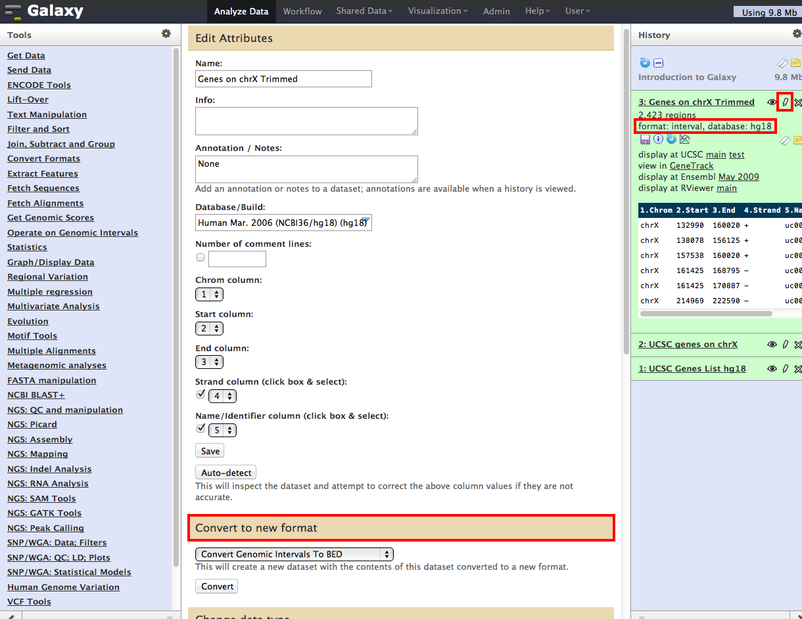

If the `Cut` tool has not already converted the dataset to `Interval`, then do so now and click `Save`. Interval format is a simple format in which Galaxy is told that the dataset contains a _start_ and _end_ column which defines a genomic interval for a feature, in this case, for genes. Usually Galaxy is good at guessing the format for you and you do not have to do this step. When a file is in interval format, there are other attributes that can be set under the pencil tool, where you tell Galaxy which columns contain which pieces of data, such as strand information, etc. In case you have to convert your dataset to interval, make sure the columns are properly set. 

* Column 1: Chromosome 
* Column 2: Start
* Column 3: End
* Column 4: Strand
* Column 5: Name

#### Filtering data
{: .no_toc}

Now let’s filter our data to only contain short genes, i.e. those that have a maximum  number of exons. Let’s say we only want to see those genes that have at most _two_ exons. 

1. Click on the `Filter and sort` tool heading, and select the `Filter` tool. 
2. Select the appropriate dataset (the latest concise, cut one, whatever you decided to call it) in `Filter`
3. Provide a condition by typing in `c6<=2`. This conditions means, select _only those rows_ (genes) in our dataset whose column 6 (exon count) is less than or equal to 2. 
4. Click on `Execute`. 

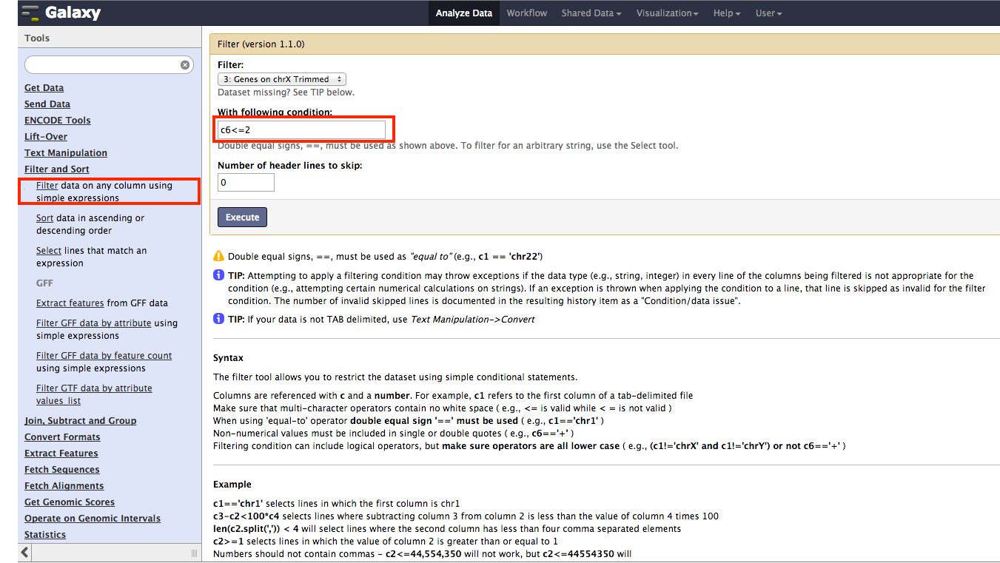

This will create a new dataset which should contain only a subset of the genes.

> How many genes remain? Galaxy's mini summary will also tell you the size of your new data set relative to the old one. To what percentage did you reduce your initial data set?

> You uploaded only genes located on chrX from your local drive. Could you have used the `Filter` tool to do the same?

Click on the eye tool on this new dataset, and you’ll see that column 6 (exon count) in this file has values of 1 or 2, which means it worked! Once again, rename this dataset and give it a useful name, such as _"chrX genes <=2 exons"_. 

### Data integration

Now that we've got our list of short genes on the X chromosome and their locations, lets pull in a list of SNPs and their locations. We will import a list of SNPs and their locations, and then join this dataset with our short genes on the X-chromosome dataset. For this, we first need to import the [SNPs](http://en.wikipedia.org/wiki/Single-nucleotide_polymorphism) dataset. Let's use the most up to date SNP build for our genome build (hg18), [SNP build 130](http://www.ncbi.nlm.nih.gov/SNP/snp_summary.cgi?view+summary=view+summary&build_id=130).

#### Online Data Repositories
{: .no_toc}

We can find this kind of data in the [UCSC Table Browser](http://genome.ucsc.edu/cgi-bin/hgTables?command=start). This electronic resource is part of the [Genome Browser](http://genome.ucsc.edu/) at University of California at Santa Cruz, a major genomics research institution that has become a world-wide standard genomics data repository. This online resource allows researchers to both visualize genomic data and obtain official, curated and published genomic sequence data.

1. Select the `Get Data` tool heading and select the `UCSC Main table browser` subheading. 
2. On the first line of the UCSC Table Browser view, select: `Clade`:"Mammal", `Genome`:"Human", `Assembly`:"Mar. 2006 (NCBI36/hg18)"
3. On the second line, select: `Group`:"Variation and Repeats", `Track`:"SNPs (130)"
4. On the third line, confirm: `Table`:"snp130" -- take a look at `describe table schema` to learn more about the data set
5. On the fourth line, make the following changes: `Region`: select the "position" button, type “chrX" into the data entry box, click `lookup` to automatically find and fill in the coordinates of the X chromosome
6. Skip the next four lines and on the ninth line make the following selections: `Output format`, select "BED – browser extensible data", tick the box to the left of `Send output to Galaxy`
7.  On the final line, click `Get output` 

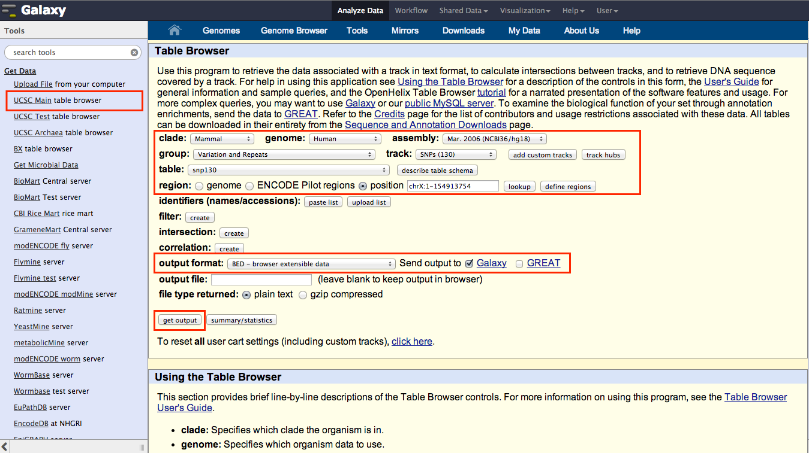

Finally, on the next page, leave all the options at their default settings and click on the `Send query to Galaxy` button. 

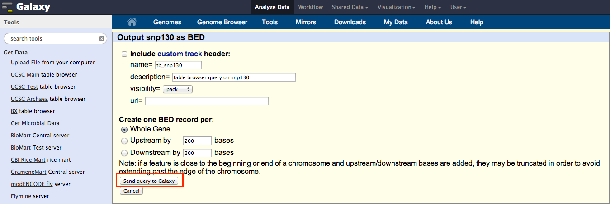

Initially the new entry in your history will be colored grey, meaning it is scheduled to run, and will turn yellow as it is imported/analysed. As before, once it finishes running successfully, it will turn green and the data will be in your history, ready to use. 

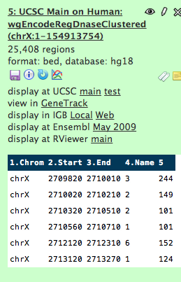

You can now click on the history name `UCSC Main on Human` where you can see more details with a short summary showing that we’ve imported ~710,000 regions. Rename these to something simpler like "SNPs on chrX".

### Intersecting genomic regions

Now that we have a our datasets ready we can tackle a the somewhat more involved data intersection steps and visualize the results. There are quite a few tools within the Galaxy system -- and do feel free to explore as much as you like -- but here we will just show you one example of what can be done. 

Our goal has been to find potential eQTLs, using SNPs in promoters as an initial group of interest. To do so, we'll need to find SNPs that are in the promoters (i.e., upstream regions) of our short genes on chromosome X. We will first need to obtain the coordinates of the upstream flanking regions, then we will join the two datasets (SNPs and promoter regions) to see whether they have an intersection and where those intersections lie.

1. Select the `Operate on genomic intervals` tool heading and click on the `Get Flanks` tool
2. Under `Select data`, select your dataset which contains chromosome X genes with two or fewer exons
3. Under `Region`, keep the option at `Whole Feature` and keep the option of `Upstream` under `Location of flanking regions`
4. Keep an `Offset` of 0, but increase the `Length of flanking region` to 500
5. Click `Execute`

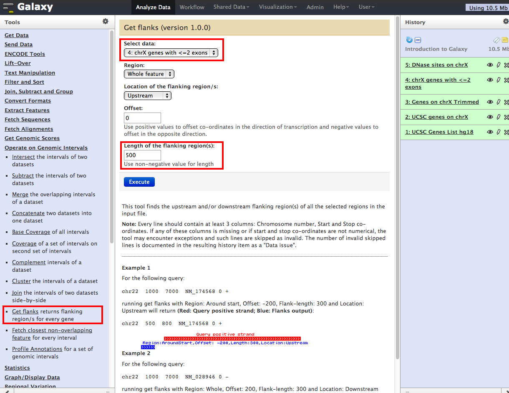

You can now rename the resulting new dataset to something like “Flanks 500bp upstream of chrX genes with <=2 exons”. Now we can join this dataset with our SNPs dataset. 

1. Under the `Operate on genomic intervals` tool heading, select the `Join` tool
2. For the `Join` dataset chose the dataset that contains the SNPs
3. For the `with`dataset choose the dataset that contains the upstream flanking regions 
4. You can choose a larger Minimum Overlap, but as SNPs are only a single bp in length, keep it at the default of 1. 
5. Double-check that you selected the right files
6. Click `Execute`

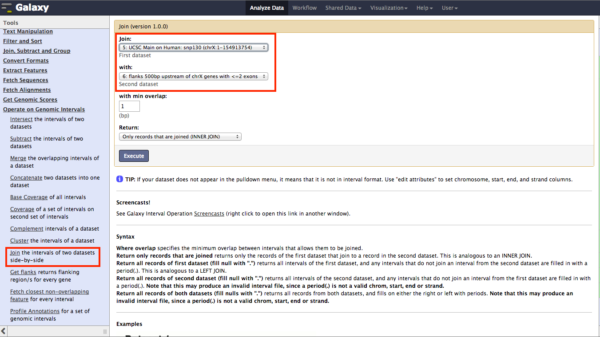

Remember to rename the new dataset. Here I'll just call it "SNP-promoter overlap". We can see that we have 964 SNPs within upstream flanking regions of genes on chromosome X with 2 or fewer exons.

This list contains our potential eQTLs and genomic information about them. Let’s click on the eye button and see what this data tells us. If the data does not fit the center pane very well, you can always resize the side panes by dragging your mouse over the pane edges. You can also hide panes by clicking on the pane edges. Let’s hide the right history pane so that we view the data clearly. 

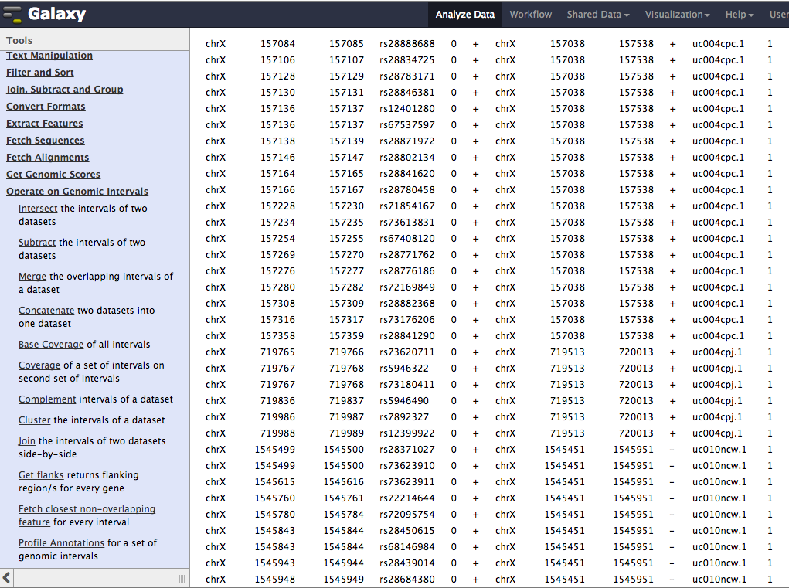

The two datasets were joined together and are now placed side by side, with only rows that show an overlap present. The first columns show information about the SNPs: column 1 shows the chromosome, column 2 shows the start position of the SNPs, column 3 shows the end position, column 4 shows the SNP name, column 6 shows the strand. The final columns contain information about the promoters and their genes: column 7 is the chromosome again (from our 2nd joined dataset), column 8 shows the start position of the promoter region, column 9 the end position, column 10 shows the strand again, column 11 shows the UCSC gene ID  and column 12 shows number of exons in the gene.

If you wanted, you could cut out columns of interest, but we'll leave this data as is for now.

### Data visualization

A picture is worth a thousand words. With gigabytes of genomic data one of the best ways of exploring patterns is visual analysis of primary and derived data. Let’s perform some simple visualizations in Galaxy with the data that we generated. 

#### UCSC Genome Browser
{: .no_toc}

Any time that you have a file in BED format (this is the format that we downloaded the data from the UCSC Table Browser as well as the data you imported), you can instantly visualize it using the [UCSC Genome Browser](http://genome.ucsc.edu/cgi-bin/hgGateway), and this functionality is integrated into Galaxy. Our first dataset that we uploaded to Galaxy was the set of coordinates for UCSC genes from chromosome X. Go back down in your history until you find this dataset:

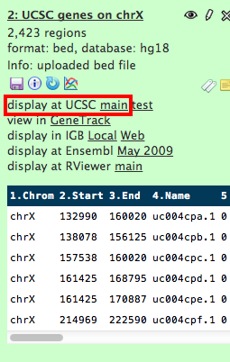

You can see right under the title that the format is “bed”, so it can be easily visualized from this box. You will see a line which says `display at UCSC`. Click on `Main`. This will open up a new internet browser window or tab which will take you directly to the UCSC Genome Browser where you can view the data that we have just uploaded. 

In addition to the data you just submitted to the browser (orange), the UCSC system comes with a large number of pre-computed "tracks" which can be turned on or off by using the controls at the bottom of the browser page. The data that we have just uploaded however (which is not built-in), is defined as a “custom track”. You can see that our data is titled “User Track”. 

#### Converting data for visualization
{: .no_toc}

We can use this approach to visualize any BED files you may have, but what do we do about the other datasets which have that are not in BED format? We will have to create custom tracks for them by using special Galaxy tools.  

Let’s say that in addition to the genes, we wish to view the upstream flanking regions of those genes, the SNPs, and finally, highlight the SNPs contained within the promoters. 

1. Select the `Graph / display data` tool heading and select the `Build Custom Track for UCSC genome browser` tool
2. Click the `Add new Track` button
3. Select the datasets you wish to display together and keep pressing `Add new Track` until you have entered all of the datasets you would like to see visualized. At each step **give each track a new name** -- if you provide identical track names they will overwrite each other. Also select colors for the tracks of your choosing.
4. Remember to include at least the the following datasets: “Flanks 500bp upstream of chrX genes with <=2 exons”, “SNPs on chrX" and "SNP-promoter overlap"
5. When you’re done, click `Execute`

Once the job finishes running, click on `Display at UCSC: Main` as we did in the previous example on the newly created dataset history entry. You’ll end up at some random position on chromosome X, but probably may not  see any of our displayed features. Enter the following coordinates to view under `Positions / Search`:

	chrX:133,980,000-134,000,000
	
and click `Jump`. Now you should see a browser view similar to the screenshot: 

It should include the "User Track" from before (which has all the genes on the X-chromosome),  the upstream regions (promoters) of our small X-chromosomal genes as well as the location of both a) all SNPs and b) SNPs found within short gene promoters. 

Go ahead an experiment with the genome browser and see what it has to offer. You can zoom in and zoom out with the buttons on top. Try right-clicking on the grey area to the left of your custom gene track (arrow in image above) and select `Full`. This will display all of the genes and their variants on separate lines. You’ll notice that previously, this track was in `Dense` mode which means that it displayed all of the information on a single line without showing the subtracks. Try the other display options and see what they look like.

### Dissemination

When you're finished with an analysis, it is always a good idea to give your history a meaningful name. 

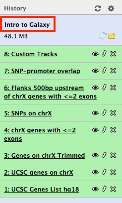

All you have to do is click above the history where it might say “Unnamed History” and type in something you like. You can also add tags by clicking on the white “tags” button to the right. Tags are short keywords that allow you to easily find histories in the future once you start getting swamped in your own histories. You can include something like “chrX” or “DNase”. 

Keep in mind your history **only persists if you are logged in**. If you click on `Options` above the history pane, you will see a long list of really useful options that you wouldn’t have access to if you hadn’t logged in. Here you can select to view all of your saved histories, convert a history to a workflow, share your history with others, see deleted datasets and many other useful things. Click on `Saved histories`.

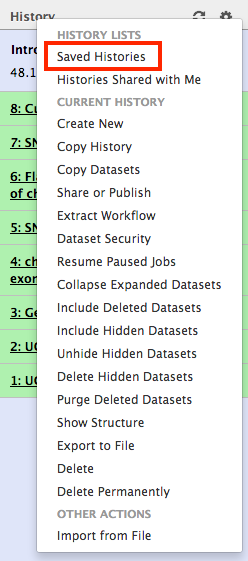

This should bring you to a list that looks like this: 

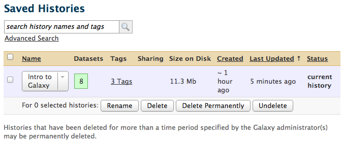

This will show you all of the histories that you have under your user account, the number of datasets per history, their tags and how large they are on disk together with other time stamp information. You can manage your histories here. Next to our only history name “lab1”, there is a small arrow. If you click on it, you will get a menu with several options: Select `Share or Publish`.

On the next screen you have a choice to publish this history via an internet link. You can make this link available to your colleagues and they’ll be able to view it and use it. You can also choose to share your history via email, where you have to type in the email of your colleagues. They need to have Galaxy accounts under those emails for this to work. Once you do this, they will have these histories accessible through their own accounts. A great and transparent way to share your analysis pipeline with others, and this vastly promotes analysis reproducibility! 

> The Galaxy team has [published the workflow history](http://main.g2.bx.psu.edu/u/aun1/p/heteroplasmy) used for the data analysis of *"Dynamics of mitochondrial heteroplasmy in three families"*. They processed reads, trimmed them, aligned them to a reference genome and called variants with pileup before filtering the pileup results. What reference genome did they align to, and during the pileup filtering step what was the lowest read coverage and base quality they accepted for called variants?

You are done with the introduction! Move on to any of the other sequencing-related modules, take a look at the optional exercises below or [let us know](../about) if you have more questions.

## Exercises

The exercise for this session is another Galaxy workflow to obtain SNP information for the current human genome build. Feel free to start the workflow during class and _do_ collaborate with your fellow students.

> Work through the exercise below, keeping notes of the results (the highlighted questions) and _share_ the workflow with your course instructor after you have finished it. Galaxy's history will serve as your lab book in this case.

* Create a new history and give it a name.
* Download exon data for human chromosome 18 from the latest _hg19_ build from the UCSC table browser in BED format[^3]. 
* Download single nucleotide polymorphism (SNP) data for the same chromosome and same build from the same source in the same format[^4]. Remember to rename your datasets!

> How many exons are in your exon file? How many SNPs on chromosome 18?

 * Join the two datasets together using the `Join` tool. We want to place the exons first (on the left) and the SNPs dataset next to it (on the right); this order is important. Perform the join so that the genomic intervals in both files have a minimum overlap of 1 base and make sure the output file contains only those regions which have an overlap. 

> What does this new dataset tell you? How many SNPs are there _on exons_ on chromosome 18? Is this value different from the number of exons or the number of SNPs we saw before? Why?[^5] 

* Try the `Group` tool under the `Join, Subtract and Group` tool heading to create a new dataset which gets rid of multiple copies of exon IDs by grouping on them, as a result collapsing all of the other data into a single line per exon ID. While you are here at this tool, you can perform basic arithmetic operations on the grouped elements. Let’s count how many duplicate copies we originally had of each exon ID. 

> How many exons contain SNPs on chromosome 18? Once you obtain this dataset, what does the second column with the values really mean?

* Try the `Sort` tool under the `Filter and Sort` tool heading in order to sort this last file in descending order on the numeric column that we discussed in the previous section. 

> What is the maximum (number of SNPs) that are present on any one exon? 

* Filter the previous dataset using the `Filter` tool to only contain rows that have at least 5 in the numeric column. 

> How many exons contain at least 5 SNPs each? What is the proportion of high SNP-density exons (with at least 5 SNPs) among all exons? 

* Rejoin this last dataset with our original exon dataset so that we now have a more complete exon dataset which also has counts of SNPs for each exon ID entry[^6]. 
* Visualize this last dataset in the UCSC Genome Browser. Select one of the exons that Galaxy just submitted to UCSC genome browser and zoom in to see the SNPs in that exon[^7]. 

- - -

[^1]: Explore some of the publicly available data via the [main Galaxy resource page](https://main.g2.bx.psu.edu/library), including supplementary materials and workflows for complete manuscripts.
[^2]: Note: next to the “pencil” button is an “X”. If you click on that, this will delete a dataset from your history. This is useful if you make a mistake along the way and you end up with data that you don’t need for subsequent steps. Otherwise, it is not recommended to delete data from your history since this will make it much harder (if not impossible) to retrace all of your steps from start to finish, and this defeats the whole purpose of the history!
[^3]: You should first select to download UCSC genes as before, but there will be additional options to limit your download to only exons. 
[^4]: Look under the `Variation and Repeats` group. Select `Common SNPs (132)`.
[^5]: Do any of the exon IDs in the joined dataset occur more than once? 
[^6]: Use the `Join` tool and join by exon ID. Remember to place the dataset with the ordered count values first (on the left) when performing the join. Remember that ordering is important when joining datasets. 
[^7]: Make sure that you have the correct SNP dataset that you chose in the beginning displayed in the UCSC genome browser. Default settings may not be appropriate. 